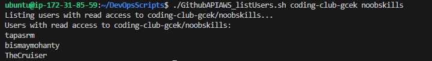

aws_resource_track.sh
----------------------------------------------------------------------------------------

To Track resources using AWS with Shell Script

A small script where using AWS, we'll be sharing resource usage of AWS Components like EC2, S3, Lambda, IAM etc. at a particular time to the reporting dashboard. Using a Cronjob.
#1: Create the EC2 instance with AWS and run in MobaxTerm (any OS) {if we need to use Linux in Windows - WSL can help as well.} and more.

**NOTE:** change your 'export AWS_DEFAULT_REGION' to your specific one.

----------------------------------------------------

GithubAPIAWS_listUsers.sh
-----------------------------------------------------------------------------------------

## Step 1: Create an EC2 instance with AWS Console. Use the public IPv4 address from there. Login using 

## Step 2: Now clone the repo to get the script.

## Step 3: Now export the username and the token, so that you're logged in to the EC2 instance:

## Step 4: Now select the organization's name you are part of (in GitHub)

< it might require to install jq library - sudo apt install jq / pip install jq >

put up in this format < ./script orgname reponame >

### Voila !!! All collaborators having read access to this repo and org will show up. 🎉

------------------------------------------------------------------------------------------

